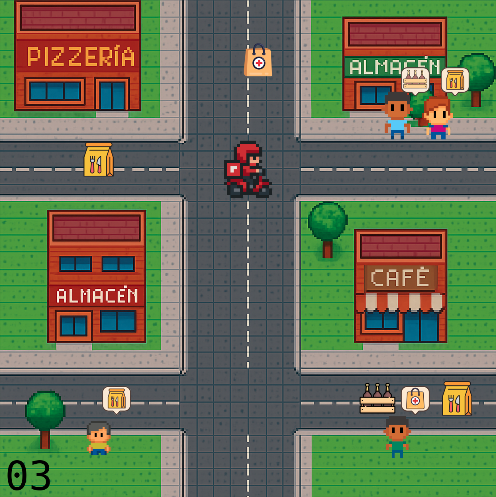

# 🎮 Pedidos WLK!

¡Bienvenidos a **Pedidos WLK!**, un juego desarrollado en Wollok donde sos un repartidor que debe entregar paquetes a clientes en un tiempo límite! 🛵 Corre contra el reloj, esquivá barreras y asegurate de entregar los pedidos correctos para ganar.

## 👥 Equipo de Desarrollo

- Depaulo Joaquin
- Elias Cardozo
- Navarro Lautaro
- Aguiar Diego

## 📸 Capturas del Juego

  
  

## 🎯 Reglas del Juego

- **Objetivo**: Entregá la mayor cantidad de paquetes a los clientes correctos antes de que se acabe el tiempo.
- **Niveles**:
  - **Nivel 1**: Tenés 60 segundos para entregar al menos 8 paquetes.
  - **Nivel 2**: Más desafiante, con 45 segundos para el mismo objetivo.
- **Mecánica**:
  - Movete por el mapa, agarrá paquetes y entregalos a los clientes que los pidieron.
  - Si llegás a entregar 8 paquetes, ganás y avanzás al siguiente nivel.
  - Si no llegás a 8 paquetes, perdés. 

## 🎮 Controles

- **WASD** o **Flechas (← ↑ ↓ →)**: Mover al repartidor.
- **H**: Agarrar un paquete.
- **J**: Entregar el paquete al cliente.
- **1** o **2**: Seleccionar Nivel 1 o Nivel 2 desde el menú.
- **Enter**: Volver al menú tras ganar o perder.

## 🏫 Otros

- **Institución**: Universidad Nacional de Hurlingham
- **Materia**: Programación con Objetos
- **Año**: 2025
- **Versión de Wollok**: 0.3.1
